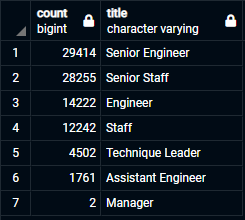
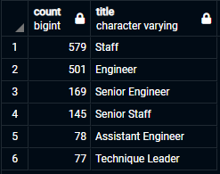
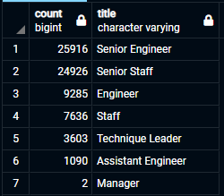

# Pewlett-Hackard-Analysis

## Purpose of Analysis
This analysis is meant to examine retirement and mentorship eligibilities within the Pewlett Hackard staff. The data that has been used comes from internal files that track the status of their staff. This is meant to show how many employees are eligible for retirement by position, and also if there are enough to mentor the next generation of employees.

## Results
#### Retirement Eligibility
The following results were shown through the analysis of retirement eligibility:

###### Retirement Eligible Staff by Position

- The most retirement eligible employees come from the Senior Staff and Senior Engineer roles. There are 29414 Senior Engineers and 28255 Senior Staff eligible.

- In total, there are 90,398 employees eligible for retirement.

#### Mentorship Eligibility
The following results were shown through the analysis of mentorship eligibility:

###### Mentorship Eligible Staff by Position

- The most mentorship eligible employees come from the Staff and Engineer roles. There are 579 Staff and 501 Engineers eligible.

- In total, there are 1,549 employees eligible for mentorship.

## Summary

The analysis shows that there are over 90,000 employees eligible for retirement and 1,549 employees eligible for mentorship. Some reasons why these two should be different is that retirement eligible emplyees were born between 1952 and 1955 which is 4 years and there is only a span of 1 year for employees to be eligible for the montorship program. Additionally, the retirement eligible chart includes employees who no longer work there, so a chart with only current employees is shown below.

This chart shows a total of 72,458 current employees which creates almost a 50:1 ratio of retirement eligible employees to mentorship eligible employees. Pewlett Hackard would need to plan on filling at least 20,000 roles a year for the next four years.

Furthermore, there is no question that there are enough qualified retirement ready employees in every department to mentor the next generation of Pewlett Hackard. There are actually about 35 retiring engineers for every mentorship eligible engineer, just as an example.
